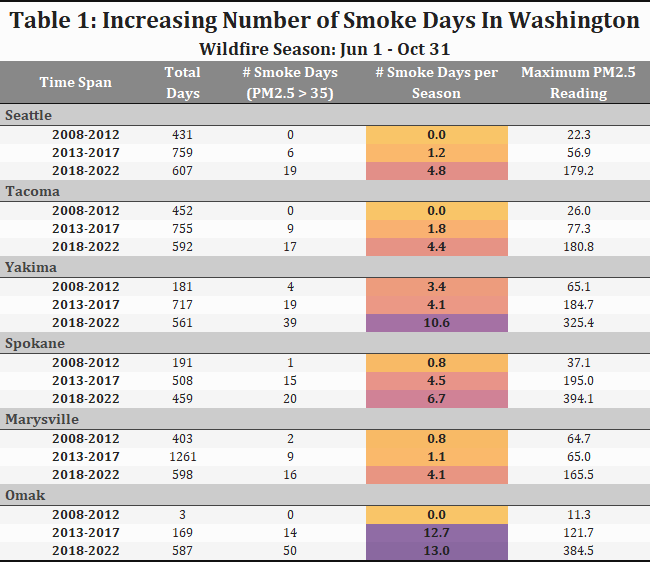

```{r setup, include=FALSE}
knitr::opts_chunk$set(echo = FALSE,
        message = FALSE,
        collapse = FALSE,
        warning = FALSE,
        cache = TRUE,
        results='asis',
        fig.pos = "H")
library(tidyverse)
library(sf)
library(rmapshaper)
library(viridis)
library(readxl)
library(terra)
library(tmap)
library(tmaptools)
library(grid)
library(gridExtra)
library(ggformula)
library(GGally)
library(kableExtra)
library(splines)
library(sjPlot)
library(geoR)
library(raster)
# library(maptools)
# library(PBSmapping)
# library(stats)
# # library(gstat)
# # library(rgdal)
# # library(ggplot2)
# # library(splancs)
# library(sp)
# library(ggpubr)
# library(RColorBrewer)
# library(rgeos)
# library(rgdal)
# library(stars)
# library(ggspatial)
# library(DT)
# library(spatialEco)
# library(utils)
# library(stringr)
# library(formattable)
# library(magick)
# library(webshot)
# library(stats)
# library(npreg)
# library(spatstat)
# library(maps)
# library(MASS)
# library(ggplotify)
# nngeo::st_nn

options(tinytex.verbose = TRUE)

# Function to cleanly expand a bounding box or raster extent
exp_box <- function(bb, 
                    perc = c(0.1,0.1,0.1,0.1), #bottom, left, top, right 
                    rnd = 1000) {
  if (class(bb)[1] == "Extent") { # Extent of RasterLayer
    xrng.adj.l <- (bb@xmax-bb@xmin) * perc[2]
    xrng.adj.r <- (bb@xmax-bb@xmin) * perc[4]
    yrng.adj.b <- (bb@ymax-bb@ymin) * perc[1]
    yrng.adj.t <- (bb@ymax-bb@ymin) * perc[3]
    out_ext <- extent(floor((bb@xmin-xrng.adj.l)/rnd)*rnd,
                      ceiling((bb@xmax+xrng.adj.r)/rnd)*rnd,
                      floor((bb@ymin-yrng.adj.b)/rnd)*rnd,
                      ceiling((bb@ymax+yrng.adj.t)/rnd)*rnd)
  } else if (class(bb) == "bbox") {    # sf spatial object
    out_ext <- in_box <- st_bbox(bb)
    xrng.adj.l <- (in_box[['xmax']]-in_box[['xmin']]) * perc[2]
    xrng.adj.r <- (in_box[['xmax']]-in_box[['xmin']]) * perc[4]
    yrng.adj.b <- (in_box[['ymax']]-in_box[['ymin']]) * perc[1]
    yrng.adj.t <- (in_box[['ymax']]-in_box[['ymin']]) * perc[3]
    out_ext[['xmin']] <- floor((in_box[['xmin']]-xrng.adj.l)/rnd)*rnd
    out_ext[['xmax']] <- floor((in_box[['xmax']]+xrng.adj.r)/rnd)*rnd
    out_ext[['ymin']] <- floor((in_box[['ymin']]-yrng.adj.b)/rnd)*rnd
    out_ext[['ymax']] <- floor((in_box[['ymax']]+yrng.adj.t)/rnd)*rnd
  }
  return(out_ext)
}

```

\newpage
\tableofcontents
\newpage

# Aims and Objectives
## Aims
  + In the face of climate change, wildfire smoke has become a grave threat to the health of Washingtonians. Herein is an historical and prospective analysis of wildfire smoke.
  + Wildfire smoke poses an insidious threat to the people of the Pacific Northwest. Low altitude plumes travel hundreds of miles, darkening skies, exacerbating health issues, and increasing mortality rates among vulnerable populations in their wake.
  + To better understand the historical patterns of wildfire smoke that have been intensifying over the past decade, spatial analysis can provide useful insights. {See Table 1}
  + With sufficient understanding of historical patterns, it is possible to use spatial techniques to produce crude predictions for the next several years.
  
## Objectives
  + Collect spatial datasets that can be predictive of the number of smoke days registered in Washington State.
  + Using a linear model to describe spatial patterns of smokedays, crude predictions can be made.
  + Online maps and materials made readily available for public health officials, government employees, in need of resources for long-range planning would be of real use, and image outputs would provide content and context for resource requests from funding organizations and public education efforts.

# Spatial Data and GIS

## Shape Files
  + United States shapefile from the US Census Bureau  `r paste0("   [{Click Here}](https://www.census.gov/geographies/mapping-files/time-series/geo/carto-boundary-file.html)")`
    + These are subsetted in R when required, and for the purpose of optimized Shiny presentation, simplified using the `rmapshaper` package
    + Washington is subsetted and buffered using the `st_buffer` function for different purposes.
  + Canadian provincial boundaries shapefile  `r paste0("   [{US Shapefile}](https://www.sciencebase.gov/catalog/item/5ab555c6e4b081f61ab78093)")`
  + Cities of Washington shapefile from Washington State Labor and Industries  `r paste0("  [{Click Here}](https://geo.wa.gov/datasets/LNI::li-city-limits-statewide/explore)")`
    + Simplified for Shiny using the `rmapshaper` package
  + Counties of Washington shapefile from the  Washington Geospatial Open Data Portal  `r paste0("  [{Click Here}](https://geo.wa.gov/datasets/648a84ebf320484e9d73717f76d1d042/explore?layer=3)")`
  + All functions were transformed to NAD83(2011) / Washington North (ftUS)  `r paste0("  [{Click Here}](https://epsg.io/6597)")`

## Daily Air Quality Data
  + To optimize the spatial prediction model, both US and Canadian air quality data is incorporated.
    + As Canada primarily tracks an Air Quality Health Index and the US reports an Air Quality Index, for the purposes of regression, using the common metric of particulates smaller than 2.5 microns ($PM_{2.5}$) is appropriate.
    + For the purposes of this analysis, the cutoff of what constitutes a _smoke day_ based on this common scale can rely on EPA guidance, where an AQI of 100 is considered "Unhealthy for Sensitive Groups" (older adults, children, etc.) `r paste0("  [{Click here}](https://www.airnow.gov/aqi/aqi-basics/)")`
    + A point of equivalency along a 5-part spline between AQI and $PM_{2.5}$ is at roughly $PM_{2.5}$ = 35; AQI = 100. {See Figure 1}
  + US Environmental Protection Agency Data `r paste0("  [{Click here}](https://envistaweb.env.gov.bc.ca)")`
    + Processed for the years 2008-2021 using `dplyr` functions
    + Daily tables contained Latitude, Longitude, and Arithmetic Mean of PM2.5
      + Arithmetic Mean is used universally for all AQ monitors, which is the mean of $PM_{2.5}$ throughout the day at a station, rather than a daily max.
  + British Columbia Provincial Air Quality Data `r paste0("  [{Click here}](https://aqs.epa.gov/aqsweb/airdata/download_files.html#Daily)")`
    + Processed for the years 2008-2021 using `dplyr` functions
    + Data was hourly at all monitors, so a daily mean was calculated per day with `summarise`
  + A combined point shape file of all monitors within 150 miles of the Washington border was created using a 150 mile WA shapefile using Latitude and Longitude
    + Using functions `st_as_sf`, `st_buffer`, `st_intersection`, `st_transform`
  + Smoke data was tabulated if it fell between June 1 and October 31. If not all days within that 153 day window were tallied, data was imputed and normalized to a 'Smoke days per 153 days' for the sake of comparison.
    + Monitors were excluded if fewer than 100 days were tallied during the wildfire season (65.4% of days) to include as many monitors as possible, but not over-interpret the data.
    
## Wildfire Risk Datasets
  + Proximity to areas at high risk of wildfire is undoubtedly a risk factor for wildfire smoke and the US Forest Service produced a raster in 2020 of Wildfire Hazard Potential at 270m resolution.  `r paste0("  [{Click here}](https://www.fs.usda.gov/rds/archive/Catalog/RDS-2020-0016)")`
    + This is a complex score based on historical precipitation patterns, soil moisture, elevation, slope, fuel, and other measures. On a linear scale.
  + To the north of Washington, British Columbia also produces a raster layer of risk known as the BC Provincial Strategic Threat Analysis (PSTA). {See Map 1}
    + Data is categorized into 10 broad groups based on wildfire risk.
  + As the Canadian and US raster layers are of different scales, treating them as different metrics required the buffer zones to be split according between intersection with the raster layers.
    + Performing a simple transformation of data for the can2019 raster [$2^{val-3}$] aligns the values closer to one another. {See Figure 2, visualized in log space}
    + Rasters are masked to a 500 buffer of the Washington border.
  + Exposure to wildfire risk was summarized to each air quality monitor using buffer zones of 40, 80, and 125 radius exclusive using `st_buffer` and `st_difference` functions. 
    + Traversing the national border splits 3 buffer zones into a total of 6 covariate values for each monitor using the `st_intersection` function. Note that some monitors will have 0 as their values if no overlap with a raster occurs. {See Map 2}

# Spatial Statistics

## Gathering Covariates
  + Gather Zonal Statistics Around AQ Monitors from buffer zones
    + Looping through the buffer areas, using the `terra` package's `rast` and `extract` functions, the summary statistic of the $75^{th}$ percentile value of each zone was calculated as a better fit than mean, median, or maximum.
    + Weighting of these values is applied, based on percent overlap with the raster.
      + If only 40% of the overall buffer area overlaps the BC raster, the zonal statistic is multiplied by 0.4.
      + As area over water is excluded, it is possible for a buffer area's two parts to not have a total weight that adds to 1. Conceptually this is appropriate as risk of a forest fire on water is *0*.
    + Given raster transformations and weighting by overlap area, matching buffer covariates can be simplified by summing them. {See Figure 3}
  + As this is a spatiotemporal problem, the year is a covariate in the analysis, following the worsening wildfire conditions over the past decade.
    + As a function of year, there is considerable variability in the number of smoke days. Note that 2019 was a conspicuously smoke-free year. {See Figure 4}
    + Data is compiled into biennial data to strengthen the model's predictive power, accounting for considerable year-to-year variability in the number of annual smoke days. {See Figure 5}
      + One advantage of this approach is that this is meant to be a useful guide for elected officials for planning purposes, and budget cycles on the local level are biennial.
    + As a spatiotemporal problem, easting and northing can also be included in the model.
      + By using *easting* and *northing* as surrogates, broad geographic trends like temperature, precipitation, and elevation can be incorporated as covariate terms, defined by a smooth spline interacting with time (biennium). {See Figure 6}

## Regression of Smoke Days
  + Once compiled into a dataframe using `dplyr` functionality, we test covariates for Correlation
    + Covariates are relatively correlated, and the significance of the most highly covariates, the 40- and 80-mile buffers can be investigated after regression. {See Figure 7}
  + An initial Poisson regression using `glm` is run, as a count-based outcome might be a good fit for the data. {See Table 2}
    + The regression is considerably overdispersed, therefore a linear model is deemed most appropriate
  + A simple linear model provides a robust fit using `lm`.
    + The 125 mile buffer was not significant, so was dropped from the final model. {See Table 3}
    + The interaction term shows clear spatiotemporal trends {See Figure 8}

## Universal Kriging
  + Visualized with semivariograms, residuals from the historical data show the model accounts for a significant portion of the spatial variation that existed in the data. {See Figure 9}
    + WLS fits for the residual error is conducted using the `variofit` function
  + Projections for the additional two bienniums is performed using the `predict` function.
    + With no residuals to draw from for projections, the error model for universal kriging must be semivariogram fitting for the predicted data. {See Figure 10}
  + Universal kriging for the 5 historical and 2 projected Bienniums can move forward using the linear model and the `krig.conv` function.{See Map 3}

# Results 
## Spatial Joins of Kriges to Municipalities
  + The 7 Kriges can be joined to the shape files of cities and counties. {See Map 4}
    + Again, `terra::extract` is used to gather the $75^{th}$ percentile value of the overlapping polygon of all cities and counties.
  + These outputs are easily ported to a Shiny app that I designed, so that data can be perused and investigated by the public officials to aid in planning and budgeting for the wildfire smoke threat in the coming years.
  + The resulting map of cities and counties shows clear spatial patterns. As a function of time, the Shiny app is a useful tool.
  + `r paste0("  [Click here for the Shiny App!](https://pmross0098.shinyapps.io/MRoss_SmkDaysWA/)")`
  
# Discussion
  + Additional work can be done regarding model selection. A linear model provides a good fit, but a negative binomial fit is another possibility, with the `FRK` package able to krige using such a model.
  + Additional work on the Shiny app includes:
    + A selection menu to select and zoom to either a city or county of interest.
    + A screenshot button to allow for a user to easily take a screen capture of their region of interest.
  
\newpage

``` {r loadshapefiles}
dat_dir <- "Data"
out_dir <- "Outputs"
WA_shp <- read_sf(file.path(dat_dir, "WA_Only/WA_Only.shp")) %>%
  st_transform(crs = 6597) %>%  # 6596 (m) -OR- 6597 (ft)
  ms_filter_islands()
WABuf150_shp <- WA_shp %>% st_buffer(dist = 150*5280)
WABuf300_shp <- WA_shp %>% st_buffer(dist = 300*5280)
Can_shp <- read_sf(file.path(dat_dir, "Canada/CanadaProv.shp")) %>%
  st_transform(crs = 6597) %>% 
  ms_filter_islands()
AllUS_shp <- read_sf(file.path(dat_dir, "All_US/All_US.shp")) %>%
  st_transform(crs = 6597)
BCclip_shp <- read_sf(file.path(dat_dir, "BC_Clip/BC_Clip.shp")) %>%
  st_transform(crs = 6597)
rst2020 <- raster::raster(file.path(dat_dir, "USrast/w001001.adf"))
lnrst2020 <- log(rst2020+1)
rm(rst2020)
canrst <- raster::raster(file.path(dat_dir, "BCrast/w001001.adf")) %>%
  terra::mask(BCclip_shp)

City_shp <- read_sf(file.path(dat_dir, "City_Limits/CityLimits.shp")) %>%
  st_transform(crs = 6597)
County_shp <- read_sf(file.path(dat_dir, "WA_Counties/Counties.shp")) %>%
  st_transform(crs = 6597)

```

```{r AQmungeUS}
# Grab and process US Air Quality data from 2008-2022
rt <- "https://aqs.epa.gov/aqsweb/airdata/daily_88101_" # root location for 88101 tables
nwstates <- c("Washington", "Oregon", "Montana", "Idaho") # narrow to just 4 states

lngUS_df = data.frame(matrix(nrow = 0, ncol = 34)) #empty dataframe
#cycle through them
for (yr_dat in 2008:2022) {
  temp <- tempfile()
  download.file(paste0(rt, yr_dat, ".zip"), temp, quiet = TRUE)
  
  AQ_dat <- read.csv(unzip(temp))
  # Data between 6/1 and 10/31
  # Find #AQI>100 days per site
  AQ_dat <- AQ_dat %>%
    dplyr::filter(!is.na(Arithmetic.Mean)) %>% #ignore data with missing PM2.5
    dplyr::filter(State.Name %in% nwstates) %>% #just WA, OR, ID, MT
    dplyr::mutate(Date = as.Date(Date.Local), #grab year, month, day
                  Yr = as.integer(str_sub(Date.Local,1,4)),
                  Mo = as.integer(str_sub(Date.Local,6,7)),
                  Day = as.integer(str_sub(Date.Local,9,10))) %>%
    dplyr::filter(Mo > 5 & Mo < 11) %>% # only interested in June-Oct
    filter(Yr > 2007 & Yr < 2022) %>%
    dplyr::mutate(Site = str_to_title(Local.Site.Name)) #make the column headers less crappy

  lngUS_df <- rbind(lngUS_df, AQ_dat) # add filtered cleaned data to growing dataframe
  file.remove(paste0("daily_88101_", yr_dat, ".csv")) # delete unzipped file
  unlink(temp)
}
rm(AQ_dat)

# Prep Table
# create timespan column for 5 year `eras`
lngUS_df$Span <- '2008-2012'
lngUS_df$Span[lngUS_df$Yr > 2012 & lngUS_df$Yr < 2018] <- '2013-2017'
lngUS_df$Span[lngUS_df$Yr > 2017 & lngUS_df$Yr < 2023] <- '2018-2022'

# Clean up location info from AQ Data
lngUS_df$Site[is.na(lngUS_df$Site)] <- lngUS_df$City.Name[is.na(lngUS_df$Site)]
lngUS_df$Site[lngUS_df$Site==''] <- lngUS_df$City.Name[lngUS_df$Site=='']
lngUS_df$Site[lngUS_df$Site == 'Not in a city'] <- 'Spokane Valley'

```

``` {r renameUS}
# rename Site to succinct names
names_df <- read.csv("Data/rename.csv")

lngUS_df$Site <- names_df$Final.Site[match(lngUS_df$Site, names_df$Site)]

write.csv(x = lngUS_df, file = "Outputs/AQus_Munge_full.csv") #output

```


``` {r smkthreat}

# conversion of monitor name to just city for 6 monitors of interest I'll highlight in a table
# I chose these because the data was near complete for the 3 "eras" I'm looking at
# I'm also ordering these according to how I want' them arranged in the final table
locs <- c('Seattle','Tacoma','Yakima','Spokane','Marysville','Omak')

# big dataframe to capture # smoke days (AQI > 100)
smkdy_df <- lngUS_df %>%
  filter(Yr > 2007) %>% #only 2008 and later
  group_by(Site, Sample.Duration, Span, Latitude, Longitude) %>% # two criteria
  summarize(n = n(), Smoke.Days = sum(Arithmetic.Mean>35),
            MaxPM25 = max(Arithmetic.Mean)) %>% # by group, adding summary of
  # total days, smoke days, max AQI in 5 year period
  add_tally(name = "sets") %>%      # this is to point out which sets are complete when I was exploring data
  filter(Site %in% locs) %>% # just the 6 monitors of interest, each had a tally = 3 eras
  mutate(Per153 = Smoke.Days*153/n,
         Prob = round(Smoke.Days/n ,3),          # simple probability, Smoke Days / total days with observations
         Location = locs[Site],                  # Simplified name
         srt = which(Site == locs)) %>%   # This gives me an extra column to sort on based on my `locs`
  ungroup() %>%
  group_by(Site, Span) %>%
  slice(which.max(Smoke.Days)) %>%
  arrange(srt, Span) %>%                     # sort first by sort column, then by era
  ungroup() %>%
  dplyr::select(Span, n, Smoke.Days, Prob, MaxPM25)  # Select columns of interest in order I want them displayed

# rename column headers for display
colnames(smkdy_df) <- c('Time Span','Total Days','n Smoke Days (PM2.5 > 35)',
                        'Probability of Smoke Day','Maximum PM2.5 Reading')

```

{width=80%}

Table 1: The growing wildfire smoke threat in 6 WA locations
<br>

``` {r pm25aqi, fig.dim=c(7,3.5)}
# Plot the trend(s) of AQI vs PM2.5 readings in 2020 US data
# Observe rough equivalence between AQI = 100 and PM2.5 = 35
# Will move forward with daily avq = 35 to define a smoke day
temp <- tempfile()
download.file(paste0(rt, "2020.zip"), temp, quiet = TRUE)

pmaq_df <- read.csv(unzip(temp))
pmaq_df <- pmaq_df %>%
  filter(State.Code == 53) %>%
  filter(!is.na(AQI))

segs <- data.frame(x = c(0,12.5,55,150,350),
                   y = c(0,52,150,200,400),
                   xend = c(12.5,55,150,350,500),
                   yend = c(52,150,200,400,500))
seglms <- data.frame(matrix(nrow = 0, ncol=2))
seglms <- rbind(summary(lm(as.numeric(segs[1,c(2,4)]) ~
                            as.numeric(segs[1,c(1,3)])))$coefficients[,1])
seglms <- rbind(seglms, summary(lm(as.numeric(segs[2,c(2,4)]) ~
                            as.numeric(segs[2,c(1,3)])))$coefficients[,1])
seglms <- rbind(seglms, summary(lm(as.numeric(segs[3,c(2,4)]) ~
                            as.numeric(segs[3,c(1,3)])))$coefficients[,1])
seglms <- rbind(seglms, summary(lm(as.numeric(segs[4,c(2,4)]) ~
                            as.numeric(segs[4,c(1,3)])))$coefficients[,1])
seglms <- rbind(seglms, summary(lm(as.numeric(segs[5,c(2,4)]) ~
                            as.numeric(segs[5,c(1,3)])))$coefficients[,1])
colnames(seglms) <- c("Int","Slp")
seglms <- data.frame(seglms)
seg <- geom_segment(data = tribble(), aes(x=c(0,12,56,150,350),
                                          y=c(0,50,150,200,400),
                                          xend=c(12,56,150,350,500),
                                          yend=c(50,150,200,400,500)),
                    color = "blue", linewidth = 1)

a_pl <- ggplot(data = pmaq_df, aes(x = Arithmetic.Mean, y = AQI)) +
  geom_point(size = 2, alpha = 0.5) +
  theme_bw() +
  labs(x = "P.M 2.5") + #seg
  geom_segment(data = segs, aes(x=x,y=y,xend=xend,yend=yend),color = "blue", linewidth = 1) +
  geom_hline(yintercept=100, color = "red", alpha = 0.5, linetype = 2) +
  geom_vline(xintercept=35, color = "red", alpha = 0.5, linetype = 2)

b_pl <- ggplot(data = pmaq_df, aes(x = Arithmetic.Mean, y = AQI)) +
  geom_point(size = 2, alpha = 0.5) +
  theme_bw() +
  xlim(c(25,50)) +
  ylim(c(90,110)) +
  labs(x = "", y = "", title = "AQI = 100") + theme(title = element_text(face = "bold", size = 8),
                                                     axis.title = element_blank(),
                                                    axis.text = element_text(size = 6)) +
  geom_abline(data = seglms[2,], aes(slope = Slp, intercept = Int), color = "blue", linewidth = 1) +
  geom_hline(yintercept=100, color = "red", alpha = 0.5, linetype = 2) +
  geom_vline(xintercept=35, color = "red", alpha = 0.5, linetype = 2)


c_pl <- ggplot(data = pmaq_df, aes(x = Arithmetic.Mean, y = AQI)) +
  geom_point(size = 2, alpha = 0.5) +
  theme_bw() +
  xlim(c(5,20)) +
  ylim(c(30,70)) +
  labs(x = "", y = "", title = "First Turn") + theme(title = element_text(face = "bold", size = 8),
                                                     axis.title = element_blank(),
                                                     axis.text = element_text(size = 6)) +
  geom_abline(data = seglms[1:2,], aes(slope = Slp, intercept = Int), color = "blue", linewidth = 1)

d_pl <- ggplot(data = pmaq_df, aes(x = Arithmetic.Mean, y = AQI)) +
  geom_point(size = 2, alpha = 0.5) +
  theme_bw() +
  xlim(c(35,75)) +
  ylim(c(110,190)) +
  labs(title = "Second Turn") + theme(title = element_text(face = "bold", size = 8),
                                      axis.title = element_blank(),
                                      axis.text = element_text(size = 6)) +
  geom_abline(data = seglms[2:3,], aes(slope = Slp, intercept = Int), color = "blue", linewidth = 1)

e_pl <- ggplot(data = pmaq_df, aes(x = Arithmetic.Mean, y = AQI)) +
  geom_point(size = 2, alpha = 0.5) + seg +
  theme_bw() +
  xlim(c(130,170)) +
  ylim(c(175,225)) +
  labs(x = "", y = "", title = "Third Turn") + theme(title = element_text(face = "bold", size = 8),
                                                     axis.title = element_blank(),
                                                     axis.text = element_text(size = 6)) +
  geom_abline(data = seglms[3:4,], aes(slope = Slp, intercept = Int), color = "blue", linewidth = 1)

pl <- grid.arrange(arrangeGrob(a_pl, ncol=1), arrangeGrob(b_pl, c_pl, d_pl, e_pl, ncol = 2),
                   widths=c(1.5,1), 
                   top=textGrob("Figure 1: Association of PM2.5 and AQI\nWashington State Data in 2020",
                                         gp=gpar(fontsize=16, fontface="bold")))
ggsave(filename = "Outputs/PM25-AQI.png", device = "png", plot = pl, height = 3.5, width = 6.5, dpi = 200)

file.remove(paste0("daily_88101_2020.csv")) # delete unzipped file
unlink(temp)

rm(a_pl, b_pl, c_pl, d_pl, e_pl, pl)
rm(seglms, segs, seg)
```

Figure 1: Defining a smoke day equivalency between the AQI and $PM_{2.5}$ scales
<br>

``` {r USsites}
# Create monitor shape file
# how many sites have at least 75% of the 153 days between May and Oct
days_df <- lngUS_df %>%
  filter(Yr > 2007 & Yr < 2022) %>%
  group_by(Yr, Site) %>%  
  summarize(n = n(),
            smkdays = sum(Arithmetic.Mean > 35),
            per153 = smkdays*153/n) %>%
  filter(n > (153 * 0.65)) %>% ungroup()

# Drop years prior to 2012
lngUS_df <- lngUS_df[lngUS_df$Yr > 2011,]

# Filter to just relatively rich data sites with more than 200 days 2008-2021
site_df <- lngUS_df %>%
  group_by(Site) %>% 
  summarise(n = n(),
            smkdays = sum(Arithmetic.Mean > 35),
            per153 = smkdays*153/n,
            Longitude = mean(Longitude),
            Latitude = mean(Latitude)) %>%
  filter(n > 100) %>%
  ungroup() 

siteUS_shp <- st_as_sf(site_df, coords = 5:6, crs = 4326) %>% 
  st_transform(6597) %>%
  st_intersection(WABuf150_shp)%>%
  dplyr::select(-c(STATE, NAME, FIPS))

if(!dir.exists("Outputs/AQSite")) dir.create("Outputs/AQSite")
st_write(siteUS_shp, file.path(out_dir, "AQSite/US_AQSite.shp"), 
         append = F, quiet = T)
sites <- unique(siteUS_shp$Site)

days_df <- days_df[days_df$Site %in% sites, ]

```

```{r AQmungeCan}
# Do the same for BC AQ data
rt <- "ftp://ftp.env.gov.bc.ca/pub/outgoing/AIR/AnnualSummary/"

lngBC_df = data.frame(matrix(nrow = 0, ncol = 9)) #empty dataframe
#cycle through them
# cat("Finished: ")
for (yr_dat in 2008:2021) {
  temp <- tempfile()
  download.file(file.path(rt, yr_dat, "PM25.csv"), temp)
  
  AQ_dat <- read.csv(temp)
  AQ_dat <- AQ_dat %>%
    dplyr::filter(!is.na(RAW_VALUE)) %>% #ignore data with missing PM2.5
    group_by(DATE, EMS_ID, STATION_NAME) %>%
    summarize(PM25 = mean(RAW_VALUE)) %>%
    ungroup() %>%
    dplyr::mutate(DATE = as.Date(DATE), #grab year, month, day
                  Yr = as.integer(str_sub(DATE,1,4)),
                  Mo = as.integer(str_sub(DATE,6,7)),
                  Day = as.integer(str_sub(DATE,9,10))) %>%
    dplyr::filter(Mo > 5 & Mo < 11) %>% # only interested in June-Oct
    dplyr::mutate(STATION_NAME = str_to_title(STATION_NAME)) #make the column headers less crappy

  lngBC_df <- rbind(lngBC_df, AQ_dat) # add filtered cleaned data to full dataframe
  file.remove(paste0("PM25.csv")) # delete unzipped file
  unlink(temp)
}
rm(AQ_dat)

# Prep Table
# create timespan column for 5 year `eras`
lngBC_df$Span <- '2008-2012'
lngBC_df$Span[lngBC_df$Yr > 2012 & lngBC_df$Yr < 2018] <- '2013-2017'
lngBC_df$Span[lngBC_df$Yr > 2017 & lngBC_df$Yr < 2023] <- '2018-2022'
lngBC_df$EMS_ID <- str_pad(lngBC_df$EMS_ID, 7, pad = "0") #make sure the 0's are added

# Get the LatLong from Station List
stat_df <- read.csv(file.path(dat_dir, "bc_air_monitoring_stations.csv"))
mch <- match(lngBC_df$EMS_ID, stat_df$EMS_ID)

lngBC_df <- lngBC_df %>%
  mutate(Latitude = stat_df$LAT[mch],
         Longitude = stat_df$LONG[mch])

write.csv(x = lngBC_df, file = "Outputs/AQbc_Munge_full.csv")

```

``` {r canshp}
# Create Shapefile for BC Air Quality monitors
siteBC_shp <- lngBC_df %>%
  group_by(STATION_NAME, EMS_ID, Longitude, Latitude) %>%
  summarize(n = n(),
            smkdays = sum(PM25 > 35),
            per153 = smkdays*153/n) %>%
  filter(n > 100) %>%
  ungroup() %>%
  st_as_sf(coords = 3:4, crs = 4326) %>% 
  st_transform(6597) %>%
  st_intersection(WABuf150_shp) %>%
  dplyr::select(-c(STATE, NAME, FIPS))

colnames(siteBC_shp)[1:2] <- c("Site","Site.Num")
siteBC_shp <- siteBC_shp[siteBC_shp$Site.Num != "M110517", ] # Duplicate, remove

if(!dir.exists("Outputs/AQSite")) dir.create("Outputs/AQSite")
st_write(siteBC_shp, file.path(out_dir, "AQSite/BC_AQSite.shp"), 
         append = F, quiet = T)

```

``` {r combAQs}
# Combine the AQs from US and BC

allsites_shp <- bind_rows(siteUS_shp, siteBC_shp)

all_sites <- allsites_shp$Site.Num

```


``` {r sitelist}
# Map rasters and AQ Sites within 150mi of WA border
tm_shape(AllUS_shp) + 
    tm_fill(col = "antiquewhite", alpha = 1) + 
    tm_borders(col = 'black', lwd = 1.2) + 
  tm_shape(Can_shp) + 
    tm_fill(col = "antiquewhite", alpha = 1) + 
    tm_borders(col = 'black', lwd = 1.2) + 
  tm_shape(lnrst2020) +
    tm_raster(style = "cont", palette = "-RdYlGn",
              title = "log(WHP\nus2020)", midpoint = 5, alpha = 0.5) +
  tm_shape(canrst) +
    tm_raster(style = "cont", palette = "-RdYlGn",
              title = "PTSA BC", midpoint = 5, alpha = 0.5) +
  tm_shape(WABuf300_shp, is.master = TRUE) + #, 
           # bbox = exp_box(st_bbox(WABuf300_shp), perc = c(0.1,0.1,0.1,0.10))) +
    tm_fill(col = NA, alpha = 0) + 
    tm_borders(col = 'grey20', lwd = 1.5) + 
  tm_shape(WABuf150_shp) +#,  
           #bbox = exp_box(st_bbox(WABuf_shp), perc = c(0.15,0.15,0.15,0.15))) +
    tm_fill(col = NA, alpha = 0) + #"antiquewhite"
    tm_borders(col = 'grey20', lwd = 1.5) + 
  tm_shape(WA_shp) + 
    tm_fill(col = NA, alpha = 0) + 
    tm_borders(col = 'black', lwd = 2) + 
  tm_shape(allsites_shp) +
    tm_symbols(size = 0.17, alpha = 1, col = "n",
               title.col = "Days\nMeasured\n2012-20", border.lwd = 2) +
  tm_compass(type = "4star",
             position = c(0.05, 0.1),
             show.labels = 2,
             size = 2.5,
             text.size = 0.8) +
  tm_scale_bar(text.size = 0.8,
               position = c(0.05, 0.008),
               breaks = c(0,100,200,400)) +
  tm_layout(main.title = "WA State: +150mi Monitor Buffer, +500mi Rasters",
            main.title.position = 0,
            main.title.size = 1.3,
            legend.outside = TRUE,
            bg.color = "lightblue")
```

Map 1. US and BC rasters of wildfire risk are masked to within 500 miles of the Washington border, with the US values in log scale for the sake of comparison. US and BC AQ monitors are used within 150 miles of the Washington border. Note that not all monitors are complete datasets between 2012-2021
<br>

``` {r rastwork, fig.dim = c(5,6)}
# Investigate values for rasters in log space
# Found not to be in same range of values, so will execute simple transform
yrs <- c("log(us2020+1)", "can2019")# 
files <- c(file.path(dat_dir, "USrast/w001001.adf"),
           file.path(dat_dir, "BCrast/w001001.adf"))

#Build df for raster values
rastvals_df <- data.frame()
for (i in seq(1:length(files))) {
  temprast <- raster::raster(files[i])
  clvals <- which(!is.na(getValues(temprast)))
  vals <- sample(getValues(temprast)[clvals], length(clvals)*0.01)
  if (i == 1) vals <- log(vals+1)
  if (i == 2) vals[vals<1] <- 0
  rastvals_df <- rbind(rastvals_df, 
                       data.frame(Year = yrs[i], 
                                  Vals = vals))
}
rm(temprast, clvals, vals)

rastvals2_df <- rastvals_df
rastvals2_df$Vals[rastvals2_df$Year == "can2019"] <-
  rastvals2_df$Vals[rastvals2_df$Year == "can2019"]-3
rastvals2_df$Vals[rastvals2_df$Year == "can2019" &
                    rastvals2_df$Vals < 0] <- NA
rastvals2_df$Year[rastvals2_df$Year == "can2019"] <- "can2019 - 3"

usrst_v <- ggplot(rastvals_df[rastvals_df$Year == "log(us2020+1)",], 
               aes(x = Vals)) + 
  geom_density(color = "blue") + 
  xlim(0,11.5) +
  ylim(0,0.4) +
  theme_bw() + 
  labs(title = "Wildfire Hazard Potential in US", y = "KDE", x = "log(Raster Values)") 

canrst_v <- ggplot(rastvals_df[rastvals_df$Year == "can2019",], 
                aes(x = Vals)) + 
  geom_density(color = "red") + #adjust = 2
  ylim(0,0.4) +
  xlim(0,11.5) +
  theme_bw() + 
  labs(title = "British Columbia PSTA", y = "KDE", x = "Raster Values") 

togrst_v <- ggplot(rastvals2_df, aes(x = Vals, color = Year)) + 
  geom_density(adjust = 3) + 
  scale_color_manual(values = setNames(c("blue","red"), c("log(us2020+1)", "can2019 - 3"))) +
  theme_bw() + 
  labs(title = "US WHP & BC PSTA", y = "KDE (adj=3)", x = "Transformed Raster Values") 

grid.arrange(usrst_v, canrst_v, togrst_v, ncol = 1)
rm(rastvals_df, rastvals2_df, usrst_v, canrst_v, togrst_v)

```

Figure 2: Transformation of US and Canadian raster values to more closely match a common distribution, here subtracting 3 from the Canadian raster and squaring the result, with all values <0 set to 0.
<br>

``` {r buffers}
# Create 3 buffer zones around the Air Quality monitors; full buffer circles
# Proximity-based risk of wildfire smoke at each monitor site to build model.
# Projected in US ft, so tranform in miles
aq40us_shp <- allsites_shp %>% st_buffer(dist = 40*5280)
aq80us_shp <- allsites_shp %>% st_buffer(dist = 80*5280)
aq125us_shp <- allsites_shp %>% st_buffer(dist = 125*5280)

# Loop for creating rings, by subtracting the smaller buffers to leave rings
tmp125_shp <- tmp80_shp <- filter(allsites_shp, Site.Num==1)
for (i in seq(1:nrow(aq40us_shp))) {
  tmp125_shp <- bind_rows(tmp125_shp, st_difference(aq125us_shp[i,],
                                                    aq80us_shp[i,]))#[,c(1:7)]
  tmp80_shp <- bind_rows(tmp80_shp, st_difference(aq80us_shp[i,],
                                                    aq40us_shp[i,]))#[,c(1:7)]
}
aq125us_shp <- tmp125_shp
aq80us_shp <- tmp80_shp
rm(tmp80_shp,tmp125_shp)

# Dissolve US to just one multipolygon
AllUS_shp <- ms_dissolve(AllUS_shp, field = "COUNT")

# Intersections, get area measurements and proportion of total
aq40cn_shp <- aq40us_shp %>%
  mutate(flar = as.numeric(st_area(.))/(5280^2)) %>% #full area
  st_intersection(BCclip_shp) %>%
  mutate(sqmi = as.numeric(st_area(.))/(5280^2), #area in sqmi of ring
         prop_ar = sqmi/flar) # %>% #ring proportion
aq40cn_shp[,c("FID","PRUID","PRNAME","PRENAME",
              "PRFNAME","PREABBR","PRFABBR")] <- NULL # Drop junk intersection columns
aq80cn_shp <- aq80us_shp %>%
  mutate(flar = as.numeric(st_area(.))/(5280^2)) %>%
  st_intersection(BCclip_shp) %>%
  mutate(sqmi = as.numeric(st_area(.))/(5280^2),
         prop_ar = sqmi/flar)
aq80cn_shp[ ,c("Site.Num.1","Site.1","n.1","smkdays.1","per153.1","LON.1",
                "LAT.1","FID","PRUID","PRNAME","PRENAME","PRFNAME","PREABBR",
                "PRFABBR")] <- NULL # Drop junk intersection columns
aq125cn_shp <- aq125us_shp %>%
  mutate(flar = as.numeric(st_area(.))/(5280^2)) %>%
  st_intersection(BCclip_shp) %>%
  mutate(sqmi = as.numeric(st_area(.))/(5280^2),
         prop_ar = sqmi/flar)
aq125cn_shp[ ,c("Site.Num.1","Site.1","n.1","smkdays.1","per153.1","LON.1",
                "LAT.1","FID","PRUID","PRNAME","PRENAME","PRFNAME","PREABBR",
                "PRFABBR")] <- NULL # Drop junk intersection columns
aq40us_shp <- aq40us_shp %>%
  mutate(flar = as.numeric(st_area(.))/(5280^2)) %>%
  st_intersection(AllUS_shp) %>%
  mutate(sqmi = as.numeric(st_area(.))/(5280^2),
         prop_ar = sqmi/flar)
aq80us_shp <- aq80us_shp %>%
  mutate(flar = as.numeric(st_area(.))/(5280^2)) %>%
  st_intersection(AllUS_shp) %>%
  mutate(sqmi = as.numeric(st_area(.))/(5280^2),
         prop_ar = sqmi/flar) 
aq125us_shp <- aq125us_shp %>%
  mutate(flar = as.numeric(st_area(.))/(5280^2)) %>%
  st_intersection(AllUS_shp) %>%
  mutate(sqmi = as.numeric(st_area(.))/(5280^2),
         prop_ar = sqmi/flar)
```


``` {r mapbuffs}
# Map a few of the matched buffers for the sake of visualization
sites40 <- c("Grand Forks City Hall","Wenatchee","Elk Falls Dogwood")
sites80 <- c("Kamloops Federal Building","Lynnwood","Mission")
sites125 <- c("Oakridge","Kalispell")

tm_shape(AllUS_shp) + 
    tm_fill(col = "antiquewhite", alpha = 0.5) + 
    tm_borders(col = 'black', lwd = 1.2) + 
  tm_shape(Can_shp) + 
    tm_fill(col = "antiquewhite", alpha = 0.5) + 
    tm_borders(col = 'black', lwd = 1.2) + 
  tm_shape(aq125us_shp[aq125us_shp$Site %in% sites125,]) + 
    tm_fill(col = "gold3", alpha = 0.5) + 
    tm_borders(col = 'black', lwd = 1.2) + 
  tm_shape(aq125cn_shp[aq125cn_shp$Site %in% sites125,]) + 
    tm_fill(col = "plum", alpha = 0.5) + 
    tm_borders(col = 'black', lwd = 1.2) + 
  tm_shape(aq80us_shp[aq80us_shp$Site %in% sites80,]) +
    tm_fill(col = "steelblue3", alpha = 0.5) +
    tm_borders(col = 'black', lwd = 1.2) +
  tm_shape(aq80cn_shp[aq80cn_shp$Site %in% sites80,]) +
    tm_fill(col = "turquoise2", alpha = 0.5) +
    tm_borders(col = 'black', lwd = 1.2) +
  tm_shape(aq40us_shp[aq40us_shp$Site %in% sites40,]) +
    tm_fill(col = "coral3", alpha = 0.5) +
    tm_borders(col = 'black', lwd = 1.2) +
  tm_shape(aq40cn_shp[aq40cn_shp$Site %in% sites40,]) +
    tm_fill(col = "aquamarine2", alpha = 0.5) +
    tm_borders(col = 'black', lwd = 1.2) +
  tm_shape(WABuf150_shp, is.master = TRUE,  
           bbox = exp_box(st_bbox(WABuf150_shp), perc = c(0.5,0.5,0.5,0.5))) +
    tm_fill(col = NA, alpha = 0) + 
    tm_borders(col = 'grey20', lwd = 2) +
  tm_shape(WA_shp) + 
    tm_fill(col = NA, alpha = 0) + 
    tm_borders(col = 'black', lwd = 2) + 
  tm_layout(main.title = "Buffer Check: 40, 80, 125mi",
            main.title.position = 0,
            main.title.size = 1.3,
            legend.outside = TRUE,
            bg.color = "lightblue")
```

Map 2: Select matching buffers of air quality monitors of radius 40, 80, and 125 miles. The areas are colored based on intersection with the two rasters and excluding water.
<br>

``` {r finalcompile}
# Final tally of smoke days at each monitor site (PM2.5 > 35)
# Total smoke days are imputed to 153 wildfire season days to allow for some missing data
# But sites tallying <100 days have already been filtered out to not allow overestimation
days_df <- lngUS_df %>%
  unite(Site.Num, "State.Name", "Site.Num") %>%
  filter(Yr > 2007 & Yr < 2022 &
           Site %in% sites) %>%
  group_by(Yr, Site, Site.Num, Latitude, Longitude, Sample.Duration) %>%
  summarize(n = n(),
            smkdays = sum(Arithmetic.Mean > 35),
            per153 = smkdays*153/n) %>%
  filter(n > (153 * 0.5)) %>%
  slice(which.max(per153)) %>%
  ungroup() %>%
  dplyr::select(-Sample.Duration)

daysCn_df <- lngBC_df %>%
  filter(Yr > 2007 & Yr < 2022 &
           STATION_NAME %in% allsites_shp$Site) %>%
  group_by(Yr, STATION_NAME, EMS_ID, Latitude, Longitude) %>%
  summarize(n = n(),
            smkdays = sum(PM25 > 35),
            per153 = smkdays*153/n) %>%
  filter(n > (153 * 0.5))

colnames(daysCn_df) <- colnames(days_df)
days_df <- bind_rows(days_df, daysCn_df)

rm(lngBC_df, lngUS_df, daysCn_df)

```

``` {r rastextract}
# Extract underlying raster values from each buffer zone
# default to the 75th percentile value due to optimal performance
pct <- function(x, p=0.75, na.rm = TRUE) { quantile(x, p, na.rm = na.rm) }

rst_path <- c(file.path(dat_dir, "USrast/w001001.adf"))
yr <- c(2020) #2012,2014,2018,

temprast <- terra::rast(rst_path)#raster::raster
aq40us_shp[paste0("p75.", as.character(yr))] <- 0
for (i in seq(1:nrow(aq40us_shp))) {
  aq40us_shp[i, paste0("p75.", as.character(yr))] <-
    as.numeric(terra::extract(temprast, aq40us_shp[i,], fun = pct, na.rm=TRUE))[[2]]
}
aq80us_shp[paste0("p75.", as.character(yr))] <- 0
for (i in seq(1:nrow(aq80us_shp))) {
  aq80us_shp[i, paste0("p75.", as.character(yr))] <-
    as.numeric(terra::extract(temprast, aq80us_shp[i,], fun = pct, na.rm=TRUE))[[2]]
}
aq125us_shp[paste0("p75.", as.character(yr))] <- 0
for (i in seq(1:nrow(aq125us_shp))) {
  aq125us_shp[i, paste0("p75.", as.character(yr))] <- 
    as.numeric(terra::extract(temprast, aq125us_shp[i,], fun = pct, na.rm=TRUE))[[2]]
}

rm(temprast)
st_write(aq40us_shp, append = FALSE, quiet = TRUE,
         file.path(out_dir, "AQSite/AQbuf40us.shp"))
st_write(aq80us_shp, append = FALSE, quiet = TRUE,
         file.path(out_dir, "AQSite/AQbuf80us.shp"))
st_write(aq125us_shp, append = FALSE, quiet = TRUE,
         file.path(out_dir, "AQSite/AQbuf125us.shp"))

```

``` {r can_rastextract}
## Do Canada as well ##
temprast <- terra::rast(file.path(dat_dir, "BCrast/w001001.adf"))
# Clear out negs
temprast[values(temprast) < 0] <- NA
aq40cn_shp[paste0("p75.", as.character(yr))] <- 0
for (i in seq(1:nrow(aq40cn_shp))) {
  aq40cn_shp[i, paste0("p75.", as.character(yr))] <- 
    as.numeric(terra::extract(temprast, aq40cn_shp[i,], fun = pct, na.rm=TRUE))[[2]]
}
aq80cn_shp[paste0("p75.", as.character(yr))] <- 0
for (i in seq(1:nrow(aq80cn_shp))) {
  aq80cn_shp[i, paste0("p75.", as.character(yr))] <- 
    as.numeric(terra::extract(temprast, aq80cn_shp[i,], fun = pct, na.rm=TRUE))[[2]]
}
aq125cn_shp[paste0("p75.", as.character(yr))] <- 0
for (i in seq(1:nrow(aq125cn_shp))) {
  aq125cn_shp[i, paste0("p75.", as.character(yr))] <- 
    as.numeric(terra::extract(temprast, aq125cn_shp[i,], fun = pct, na.rm=TRUE))[[2]]
}

rm(temprast)
st_write(aq40cn_shp, append = FALSE, quiet = TRUE,
         file.path(out_dir, "AQSite/AQbuf40cn.shp"))
st_write(aq80cn_shp, append = FALSE, quiet = TRUE,
         file.path(out_dir, "AQSite/AQbuf80cn.shp"))
st_write(aq125cn_shp, append = FALSE, quiet = TRUE,
         file.path(out_dir, "AQSite/AQbuf125cn.shp"))

```

``` {r compilesmk}
# Build final dataframe used for regression
# Match closest year to appropriate raster, 2008 - 2022
#          2008                     2013
rstyr <- c(2012,2014,2014,#2012,2012,2012,2012,
#               2016           2019           2022
           2014,2018,2018,2018,2020,2020,2020,2020)
colys <- c("Site", "smkdays", "n", "Per153", "Year", 
           "us40", "us80", "us125", "cn40", "cn80", "cn125", 
           "wt_us40", "wt_us80", "wt_us125", "wt_cn40", "wt_cn80", "wt_cn125",
           "wt_sm40","wt_sm80","wt_sm125")
sitereg_df <- data.frame(matrix(ncol = 20, nrow = 0))
colnames(sitereg_df) <- colys
mesr <- "p75." #"mn.mdn.

init_yr <- 2012
yr <- init_yr
for (i in seq(1:length(rstyr))) {
  yr_df <- days_df %>%
    filter(Yr == yr)

  tmp_df <- data.frame(matrix(ncol = 5, nrow = nrow(yr_df)))
  tmp_df[,1:5] <- yr_df[,c(2,7,6,8,1)]
  tmp_df[,5] <- tmp_df[,5] - init_yr
  tmp_df <- tmp_df %>%
    mutate(us40 = aq40us_shp[[paste0(mesr, 2020)]][match(yr_df$Site, 
                                                             aq40us_shp$Site)], 
           us80 = aq80us_shp[[paste0(mesr, 2020)]][match(yr_df$Site,
                                                               aq80us_shp$Site)],
           us125 = aq125us_shp[[paste0(mesr, 2020)]][match(yr_df$Site,
                                                               aq125us_shp$Site)],
           cn40 = 2^(aq40cn_shp[[paste0(mesr, 2020)]][match(yr_df$Site, 
                                                         aq40cn_shp$Site)]),
           cn80 = 2^(aq80cn_shp[[paste0(mesr, 2020)]][match(yr_df$Site, 
                                                           aq80cn_shp$Site)]),
           cn125 = 2^(aq125cn_shp[[paste0(mesr, 2020)]][match(yr_df$Site, 
                                                           aq125cn_shp$Site)]),
           wt_us40 = us40 * aq40us_shp[["prop_ar"]][match(yr_df$Site, 
                                                          aq40us_shp$Site)],
           wt_us80 = us80 * aq80us_shp[["prop_ar"]][match(yr_df$Site, 
                                                              aq80us_shp$Site)],
           wt_us125 = us125 * aq125us_shp[["prop_ar"]][match(yr_df$Site, 
                                                             aq125us_shp$Site)],
           wt_cn40 = cn40 * aq40cn_shp[["prop_ar"]][match(yr_df$Site, 
                                                           aq125cn_shp$Site)],
           wt_cn80 = cn80 * aq80cn_shp[["prop_ar"]][match(yr_df$Site, 
                                                             aq125cn_shp$Site)],
           wt_cn125 = cn125 * aq125cn_shp[["prop_ar"]][match(yr_df$Site, 
                                                             aq125cn_shp$Site)],
           wt_sm40 = 0, wt_sm80 = 0, wt_sm125 = 0)#,
  tmp_df[,6:17][is.na(tmp_df[,6:17])] <- 0
  tmp_df <- tmp_df %>%
    mutate(wt_sm40 = wt_us40 + wt_cn40,
           wt_sm80 = wt_us80 + wt_cn80,
           wt_sm125 = wt_us125 + wt_cn125)
  yr <- yr + 1
  colnames(tmp_df) <- colys
  sitereg_df <- rbind(sitereg_df, tmp_df)
  rm(tmp_df)
}

write.csv(sitereg_df, file.path(out_dir,"SiteReg_df.csv"), row.names = FALSE)
sitereg_df[5:20] <- lapply(sitereg_df[5:20], round, 3)

```


``` {r lin_dists, fig.dim=c(7,5.5)}
# Comparison of values, create justification to simplify model to bring rasters 
# in roughly the same range of values to create simple sums
# Much clearer regression model
dist_df <- sitereg_df[12:17] %>%
  reshape2::melt()
dist_df$variable <- as.character(dist_df$variable)
dist_df$variable[dist_df$variable == "wt_us125"] <- "US"
dist_df$variable[dist_df$variable == "wt_cn125"] <- "BC"

clrs <- setNames(c("red","blue","red","blue","red","blue","violet","violet","violet"),
                 c("wt_us40","wt_cn40","wt_us80","wt_cn80","US","BC",
                   "wt_sm40","wt_sm80","Sum(US+BC)"))

a <- ggplot(dist_df[dist_df$variable %in% c("wt_us40", "wt_cn40"),], 
            aes(x = value, color = variable)) + 
  geom_density() + 
  scale_color_manual(values = clrs) +
  theme_bw() + 
  theme(legend.position="none") +
  labs(title = "40mi Buffer Values", y = "KDE", x = "Raster Values") 
b <- ggplot(data = dist_df[dist_df$variable %in% c("wt_us80", "wt_cn80"),], 
            aes(x = value, color = variable)) +
  geom_density() +
  scale_color_manual(values = clrs) +
  theme_bw() + 
  theme(legend.position="none") +
  labs(title = "80mi Buffer Values", y = "KDE", x = "Raster Values") 
  
c <- ggplot(data = dist_df[dist_df$variable %in% c("US", "BC"),], 
            aes(x = value, color = variable)) +
  geom_density() +
  # scale_color_discrete(labels = c("US", "BC")) +
  scale_color_manual(values = clrs) +
  theme_bw() + 
  theme(legend.position="bottom",
        legend.title = element_blank()) +
  labs(title = "125mi Buffer Values", y = "KDE", x = "Raster Values") 

dist_df <- sitereg_df[18:20] %>%
  reshape2::melt()
dist_df$variable <- as.character(dist_df$variable)
dist_df$variable[dist_df$variable == "wt_sm125"] <- "Sum(US+BC)"

sm_a <- ggplot(dist_df[dist_df$variable %in% c("wt_sm40"),], 
            aes(x = value, color = variable)) + 
  geom_density() + 
  scale_color_manual(values = clrs) +
  theme_bw() + 
  theme(legend.position="none") +
  labs(title = "40mi Buffer Values", y = "KDE", x = "Raster Values") 
sm_b <- ggplot(data = dist_df[dist_df$variable %in% c("wt_sm80"),], 
            aes(x = value, color = variable)) +
  geom_density() +
  scale_color_manual(values = clrs) +
  theme_bw() + 
  theme(legend.position="none") +
  labs(title = "80mi Buffer Values", y = "KDE", x = "Raster Values") 
  
sm_c <- ggplot(data = dist_df[dist_df$variable == "Sum(US+BC)", ], 
            aes(x = value, color = variable)) +
  geom_density() +
  scale_color_manual(values = clrs) +
  # scale_color_discrete(labels = "Sum(US+BC)") +
  theme_bw() + 
  theme(legend.position="bottom",
        legend.title = element_blank()) +
  labs(title = "125mi Buffer Values", y = "KDE", x = "Raster Values") 

grid.arrange(a,sm_a,b,sm_b,c,sm_c, nrow = 3, ncol = 2, heights = c(2.5,2.5,3.5))

# rm(a,sm_a,b,sm_b,c,sm_c,dist_df)

```

Figure 3: Distributions of zonal statistics of buffers around each AQ monitor for US and BC rasters (right) and the distributions of the buffer areas
<br>

``` {r yearlysmk}
# Simple graph of increasing number of smoke days by year
# Also easy to see stochastic nature of # of smkdays, justifying a biennial approach
ggplot(days_df, aes(x = per153, fill = Yr)) +
  geom_histogram(bins = 12) +
  scale_fill_viridis(option = "E") +
  facet_wrap(~ Yr) +
  labs(title = "Estimated Smokedays by Year",
       subtitle = paste0(length(unique(days_df$Site)),
                         " Locations in the Pacific Northwest"),
       y = "Year", x = "Smoke Days") +
  theme_bw() +
  theme(legend.position = "none")
```

Figure 4: Starting from 2008, the US network of air quality monitors grows. To build a model with sufficient data, only years after 2011 are considered. At the same time, an acute rise in smoke days is seen in the state of Washington.
<br>

``` {r bienn, fig.dim=c(7.5,6)}
# Include X,Y coordinates for use in model
# Tag on coordinate data
xytag_df <- cbind(st_drop_geometry(allsites_shp), st_coordinates(allsites_shp))

sitereg_df$X_10mi <- xytag_df$X[match(sitereg_df$Site, xytag_df$Site)]/52800
sitereg_df$Y_10mi <- xytag_df$Y[match(sitereg_df$Site, xytag_df$Site)]/52800
sitereg_df$Per153 <- sitereg_df$smkdays/sitereg_df$n*153

bienns <- setNames(c("2012-13","2012-13","2014-15","2014-15","2016-17","2016-17",
                     "2018-19","2018-19","2020-21","2020-21"),
                   nm = c(2012:2021))
sitereg_df$X <- sitereg_df$X_10mi*52800
sitereg_df$Y <- sitereg_df$Y_10mi*52800

siteregbi_df <- sitereg_df %>%
  mutate(Bienn = bienns[as.character(.data$Year + init_yr)], 
         Year = floor(Year/2)) %>%
  group_by(Site, Bienn, X_10mi, Y_10mi, X, Y) %>%
  summarize(smkdays = sum(smkdays),
            n = sum(n),
            Per153 = smkdays/n*153,
            Year = mean(Year),
            wt_sm40 = mean(wt_sm40),
            wt_sm80 = mean(wt_sm80),
            wt_sm125 = mean(wt_sm125),
            .groups = "drop") %>%
  mutate(labs = paste(Site, Bienn, paste("X:", round(X_10mi,1), "; Y:", round(Y_10mi,1)),
                         paste("Ann.SmokeDays =",round(Per153,1)), sep = "<br>"))

```

``` {r normbien, fig.dim=c(7.5,4)}
# Final visualization of biennial approach to build a model capable of projection
xnm <- siteregbi_df %>%
  group_by(Bienn) %>%
  summarize(n=n()) %>%
  mutate(bienn.n = paste0(Bienn,": Monitors = ", n))

siteregbi_df$bienn.n <- xnm$bienn.n[match(siteregbi_df$Bienn, xnm$Bienn)]

ggplot(siteregbi_df, aes(x = Per153, fill = bienn.n)) +
  geom_histogram(bins = 15) +
  facet_wrap(~bienn.n, nrow = 2) +
  scale_fill_viridis(option = "E", discrete = T) +
  theme_bw() +
  theme(legend.position = "none") +
  labs(x = "Smoke days per Season",
       title = "Mean Smoke Day Distributions by Biennium",
       subtitle = "Annual: June 1 - October 31")

```

Figure 5: Building the regression using bienniums as the time element is a sound strategy, smoothing a substantial amount of the year-to-year variability.
<br>

``` {r nrteast, fig.dim=c(6.5,3)}
# Justification of use of splines for regression model as surrogate
# of complex topographic, environmental data
x_df <- 4
x_pl <- ggplot(siteregbi_df, aes(x = X_10mi, y = Per153, color = Bienn)) +
  geom_point() +
  scale_color_viridis(discrete = TRUE, option = "C") +
  scale_x_continuous(name = "Easting Miles", breaks = c(10,20,30,40,50,60), 
                   labels = c("100","200","300","400","500","600")) +
  geom_spline(aes(x = X_10mi, y = Per153), colour = "blue", size = 1.5,
              df = x_df, alpha = 0.6) +
  theme_bw() +
  guides(color = FALSE) +
  labs(y = "Smoke Days per Season",
       title = paste0("SmkDays by Longitude: df=",x_df))
  
y_df <- 3
y_pl <- ggplot(siteregbi_df, aes(x = Y_10mi, y = Per153, color = Bienn)) +
  geom_point() +
  scale_color_viridis(discrete = TRUE, option = "C") +
  scale_x_continuous(name = "Northing Miles", breaks = c(-20,-10,0,10,20),
                   labels = c("-200","-100","0","100","200")) +
  geom_spline(aes(x = Y_10mi, y = Per153), colour = "blue", size = 1.5,
              df = y_df, alpha = 0.6) +
  theme_bw() +
  labs(y = "Smoke Days per Season",
       title = paste0("SmkDays by Latitude: df=",y_df))

grid.arrange(x_pl, y_pl, ncol = 2, widths = c(0.43,0.57))

```

Figure 6: What we see consistently when we visualize the data by biennium and including a spline (df=4,3) is a general pattern of increasing smoke days by year and clear trends east-to-west and north-to-south. This comports with our expectations of both climate change and geography being significant factors driving wildfires and smoke with each passing year.


``` {r pairsplot, fig.dim=c(7,4.5)}
ggpairs(siteregbi_df[,c(10:13)])
```

Figure 7: Investigating the covariates of the model indicate only one concerningly high correlation, between the 40 and 80 mile buffer zones around the AQ monitors.
<br>

\newpage

$$log(\#SmokeDays_i) = log(Days_i) + \beta_{0} + \beta_{1}X_{Year_i} + \beta_{2}X_{buf40_i} + \beta_{3}X_{buf80_i} + \beta_{4}X_{buf125_i} $$

``` {r poisson_m1}
# Initial Poisson regression, showing far too much dispersion
# Not the way forward
m1 <- glm(smkdays ~ Year + + wt_sm40 + wt_sm80 + wt_sm125 + offset(log(n)),
          family=poisson, data=sitereg_df)  # offset=log(FF_df$TotPop)
# summary(m1)

m1_coef <- data.frame(Variable = str_replace_all(rownames(summary(m1)$coefficients),"_","-"),
                      Estimates = summary(m1)$coefficients[,1], 
                      `Pr(>|z|)` = format(summary(m1)$coefficients[,4], 
                             scientific = TRUE, digits = 3))
for (i in 3:5) {
  m1_coef[i,1] <- paste0(m1_coef[i,1], " (per 100)")
  m1_coef[i,2] <- m1_coef[i,2] * 100
}
m1_coef[,2] <- round(exp(m1_coef[,2]),3)
colnames(m1_coef)[3] <- "Pr(>|z|)"
resid1 <- residuals.glm(m1, type = 'pearson')

kable(m1_coef, format = "latex", align = 'lcc', row.names = F, escape = F, booktabs = T) %>% 
  kable_paper(latex_options = c("striped"), full_width = FALSE, position = "left") %>%
  add_header_above(header = c("Model 1: Poisson" = 3), 
                   font_size = 12, bold = T, extra_css = "padding: 10px") %>%
  row_spec(0, bold = TRUE) %>%
  add_footnote(label = paste0("Dispersion: ", round(sum(resid1^2),0), "\n",
                              "Compared to N-p: ", nrow(sitereg_df)-nrow(m1_coef)-1))


```

Table 2: Initial Poisson shows considerable dispersion, not surprising given the stochastic nature of the outcome data.

$$\#SmokeDays_i = \beta_{0} + \beta_{1}X_{Year_i\;{\colon}\;SPL(X-coord,4)} +  \beta_{2}X_{Year_i\;{\colon}\;SPL(Y-coord,3)} + \beta_{3}X_{wt\_sum40_i} + \beta_{4}X_{wt\_sum80_i} $$

``` {r linear_m2}
# Use linear regression with various terms, all of which are significant
m2 <- lm(Per153 ~ Year:ns(X_10mi,4) + Year:ns(Y_10mi,3) + wt_sm40 + wt_sm80, 
         data=siteregbi_df)  

m2_coef <- data.frame(Variable = str_replace_all(rownames(summary(m2)$coefficients),"_","-"),
                      Estimates = summary(m2)$coefficients[,1], 
                      `Pr(>|z|)` = prettyNum(summary(m2)$coefficients[,4], 
                              digits = 3)) #scientific = TRUE,

m2_coef[2,1] <- paste0(m2_coef[2,1], " (per 100)")
m2_coef[2,2] <- m2_coef[2,2] * 100
m2_coef[3,1] <- paste0(m2_coef[3,1], " (per 100)")
m2_coef[3,2] <- m2_coef[3,2] * 100

m2_coef[,2] <- round(m2_coef[,2], 4) 
colnames(m2_coef)[3] <- "Pr(>|z|)"

# Add residuals

kable(m2_coef, format = "latex", align = 'lcc', row.names = F, escape = F, booktabs = T) %>% 
  kable_paper(latex_options = c("striped"), full_width = FALSE, position = "left") %>%
  add_header_above(header = c("Model 2: BiAnnual, ns(Year:X,Y), 40mi, 80mi" = 3), 
                   font_size = 12, bold = T, extra_css = "padding: 10px") %>%
  row_spec(0, bold = TRUE)

```

Table 3: The final linear model incorporates the geographic spline in both easting an northing, 4- and 3-part respectively. Additionally, the 40 and 80 mile buffers are used And are both significant.

\newpage

``` {r vis_interaction, message = F, fig.dim=c(7,3.5)}
# Justification for Year and X,Y interaction terms, performing very strong
x_pl <- plot_model(m2, type = "pred", terms = c("X_10mi","Year [1,3,5]")) +
  scale_color_discrete(name = "Year", labels = c("2012-13","2016-17","2020-21")) +
  scale_x_continuous(name = "Miles", breaks = c(10,20,30,40,50),
                     labels = c("100","200","300","400","500")) +
  labs(x = "X (mi)", y = "Smoke Days per Season",
       title = "Predicted Smoke Days by Longitude") +
  theme_bw() +
  theme(legend.position = "bottom",
        legend.title = element_blank())

y_pl <- plot_model(m2, type = "pred", terms = c("Y_10mi","Year [1,3,5]"))+
  scale_color_discrete(name = "Year", labels = c("2012-13","2016-17","2020-21")) +
  scale_x_continuous(name = "Miles", breaks = c(-10,0,10,20),
                   labels = c("-100","0","100","200")) +
  labs(x = "Y (mi)", y = "Smoke Days per Season",
       title = "Predicted Smoke Days by Latitude") +
  theme_bw() +
  theme(legend.position = "bottom",
        legend.title = element_blank())

grid.arrange(x_pl, y_pl, nrow=1)

```

Figure 8: The spline fit of the Easting and Northing coordinates as an interacting function of biennium shows high significance.

``` {r krigsetup, fig.dim=c(4.5,4.5), dpi=100}
## 2mi grid, rounding bounds to miles
exts <- extent(allsites_shp)

xrng.adj <- (exts@xmax-exts@xmin)*0.1
yrng.adj <- (exts@ymax-exts@ymin)*0.1
grid <- expand.grid(x = seq(floor((exts@xmin-xrng.adj)/52800)*52800,
                            ceiling((exts@xmax+xrng.adj)/52800)*52800, len=100),
                    y = seq(floor((exts@ymin-yrng.adj)/52800)*52800,
                            ceiling((exts@ymax+yrng.adj)/52800)*52800,len=100))
exts <- extent(grid)
extmi <- extent(grid)/5280

grid <- expand.grid(x = seq(exts@xmin, exts@xmax, 
                            len=(extmi@xmax-extmi@xmin)),
                    y = seq(exts@ymin, exts@ymax,
                            len=(extmi@ymax-extmi@ymin)))

new_rast <- raster(ext = extent(grid), resolution = 5280) 
# Set the spatial resolution of the map to 0.5mi raster cells. 
crs(new_rast) <- "+init=epsg:6597" #Here we set the coordinate system of the new raster.
# title("Puget Sound: 1.0mi Grid")

```


``` {r initkriges, messages = FALSE, fig.dim=c(7.5,7)}
# Check for residual spatial variation with semivariograms, used in kriges
# Create the krige maps based on the linear regression model and AQ monitor data
# Build a krige for each biennium
vg_df <- data.frame(Year = c("2012-13","2014-15","2016-17","2018-19","2020-21",
                             "2022-23","2024-25"),
                    psill = c(5,3,35,40,65,145,145),
                    range = c(400000,1200000,900000,1000000,1100000,800000,800000),
                    nug = c(2,8,5,9,2,5,5))
if(!dir.exists("Outputs/OutRasts")) dir.create("Outputs/OutRasts")

siteregbi_df$resid <- m2$residuals
spns <- c("2012-13","2014-15","2016-17","2018-19","2020-21")
krige_lst <- list()
par(mfrow = c(3,2), mar = c(3,2.5,2.5,2))
for (i in 1:5) {
  tmp_df <- siteregbi_df[siteregbi_df$Bienn == vg_df[i,1], ]
  tmp.geo <- as.geodata(obj = tmp_df, coords.col = c("X","Y"), data.col = "Per153", 
                        covar.col = c("Year", "wt_sm80", "X_10mi", "Y_10mi"))
  tmp.resid.geo <- as.geodata(obj = tmp_df, coords.col = c("X","Y"), data.col = "resid", 
                        covar.col = c("Year", "wt_sm80", "X_10mi", "Y_10mi"))
  
  tmp.vario <- variog(tmp.geo, messages = FALSE,
                      max.dist = summary(tmp.geo)$distances.summary[2]*0.5)
  tmp.resid.vario <- variog(tmp.resid.geo,  messages = FALSE,
                      max.dist = summary(tmp.resid.geo)$distances.summary[2]*0.5)
  tmp.resid.vario.wls <- variofit(tmp.resid.vario, ini.cov.pars=c(vg_df$psill[i],
                                                            vg_df$range[i]),
                          cov.model="circular", messages = FALSE,
                          nugget=vg_df$nug[i], weights="cressie")
  
  plot(tmp.vario, pch = 16, xlab = "Distance (ft)", ylab = "Semivariance",
     pty = "m") #, , xaxt='n') #ylim = c(0,300)
  points(tmp.resid.vario$u, tmp.resid.vario$v, pch = 16, xlab = "Distance (mi)", 
         ylab = "Semivariance", pty = "m", col = "blue") #, , xaxt='n') #ylim = c(0,300)
  lines(tmp.resid.vario.wls, col = "blue", lty = 3)
  title(paste(vg_df[i,1], ":", nrow(tmp_df), "monitors"))
  
  tmp.krg <- krige.conv(tmp.geo, output = output.control(messages = FALSE),
                     locations=grid,
                     krige=krige.control(obj.model = tmp.resid.vario.wls,
                        trend.d=trend.spatial( ~ Year:ns(X_10mi,4) + 
                                              Year:ns(Y_10mi,4) + wt_sm80,
                                              tmp.geo))) 
  tmp.rast <- new_rast
  krg.vals <- tmp.krg$predict
  krg.vals[krg.vals < 0] <- 0  # Set floor at 0
  values(tmp.rast) <- krg.vals
  tmp.rast <- raster::flip(tmp.rast, direction = "y") %>%
    terra::mask(WA_shp)

  krige_lst[[vg_df[i,1]]] <- tmp.rast
  
  terra::writeRaster(tmp.rast, overwrite = TRUE, datatype = "FLT4S",
                     filename = file.path(out_dir, "OutRasts", 
                                          paste0("KrgSmk_", vg_df[i,1], ".grd")))

}

```

Figure 9: Initial Spatial variation is visualized in semivariograms using black dots and residual spatial variation is illustrated with blue dots. A WLS fit is depicted with a dotted blue line.

``` {r predmod, fig.dim=c(7.5,2.5), message = FALSE}
# Create additional kriges based on projecting the model for next two bienniums
pred_df <- siteregbi_df %>%
  filter(Year==4) %>%
  mutate(Year = 5, Bienn = "2022-23")
pred_df <- rbind(pred_df, siteregbi_df %>%
  filter(Year==4) %>%
  mutate(Year = 6, Bienn = "2024-25"))

pred_df$Per153 <- predict(m2, pred_df)

par(mfrow = c(1,2), mar = c(3,2.5,2.5,2))
for (i in 5:6) {
  tmp_df <- pred_df[pred_df$Year == i, ]
  tmp.geo <- as.geodata(obj = tmp_df, coords.col = c("X","Y"), data.col = "Per153", 
                        covar.col = c("Year", "wt_sm80", "X_10mi", "Y_10mi"))

  tmp.vario <- variog(tmp.geo, messages = FALSE,
                      max.dist = summary(tmp.geo)$distances.summary[2]*0.5)
  tmp.vario.wls <- variofit(tmp.vario, ini.cov.pars=c(vg_df$psill[i+1],
                                                      vg_df$range[i+1]),
                          cov.model="circular", messages = FALSE,
                          nugget=vg_df$nug[i+1], weights="cressie")
  
  plot(tmp.vario, pch = 16, xlab = "Distance (ft)", ylab = "Semivariance",
     pty = "m") 
  lines(tmp.vario.wls, col = "blue", lty = 3)
  title(paste(unique(tmp_df$Bienn), ":", nrow(tmp_df), "monitors"))

  tmp1.krg <- krige.conv(tmp.geo, output = output.control(messages = FALSE),
                        locations=grid,
                     krige=krige.control(obj.model = tmp.vario.wls,
                        trend.d=trend.spatial( ~ Year:ns(X_10mi,4) + 
                                              Year:ns(Y_10mi,4) + wt_sm80,
                                              tmp.geo))) 
  
  tmp.rast <- new_rast
  krg.vals <- tmp1.krg$predict
  krg.vals[krg.vals < 0] <- 0  # Set floor at 0
  values(tmp.rast) <- krg.vals
  tmp.rast <- raster::flip(tmp.rast, direction = "y") %>%
    terra::mask(WA_shp)

  krige_lst[[vg_df[i+1,1]]] <- tmp.rast
}
rm(krg.vals)
```

Figure 10: Having no model residuals to draw from for the predicted data, kriged standard error modeling is considerably higher for the projected bienniums.

``` {r overlaps}
# Gather zonal stats for cities, counties in WA, setting floor at 0
for (sp in unique(vg_df$Year)) {
  for (i in seq(1:nrow(County_shp))) {
    County_shp[i, paste0(sp)] <- 
      max(round(as.numeric(terra::extract(krige_lst[[sp]], County_shp[i,], 
                                fun = pct, na.rm=TRUE)),1),0)
  }
  for (i in seq(1:nrow(City_shp))) {
    City_shp[i, paste0(sp)] <- 
      max(round(as.numeric(terra::extract(krige_lst[[sp]], City_shp[i,], 
                                fun = pct, na.rm=TRUE)),1),0)
  }
}
# Clean shapefiles, write them out
County_shp <- County_shp[,-c(1:47,49:69)]
City_shp <- City_shp[,-c(1:11,14:22,24:39,41:46)]

if(!dir.exists("Outputs/Counties")) dir.create("Outputs/Counties")
st_write(County_shp, append = FALSE, quiet = TRUE,
         file.path(out_dir, "Counties/WACounties_smk.shp"))
if(!dir.exists("Outputs/Cities")) dir.create("Outputs/Cities")
st_write(City_shp, append = FALSE, quiet = TRUE,
         file.path(out_dir, "Cities/WACities_smk.shp"))

```


``` {r buildAQ}
# Create final AQ monitor site shape file for Shiny app
bienns <- c("2012-13","2014-15","2016-17","2018-19","2020-21","2022-23","2024-25")
findat_df <- bind_rows(siteregbi_df, pred_df)
findat_df$Per153 <- round(findat_df$Per153,1)
findat_df$resid <- round(findat_df$resid,1)

for (bien in bienns) {
  temp_df <- findat_df[findat_df$Bienn == bien,]
  allsites_shp[[bien]]<-temp_df$Per153[match(allsites_shp$Site, temp_df$Site)]
  allsites_shp[[paste0("rsd", bien)]]<-temp_df$resid[match(allsites_shp$Site, temp_df$Site)]
}

# Final filter, skip no data locations
nas_df <- allsites_shp %>%
  st_drop_geometry() %>%
  dplyr::select((ncol(allsites_shp)-6):ncol(allsites_shp)-1) %>%
  rowwise() %>%
  mutate(nas = sum(is.na(cur_data())))

allsites_shp <- allsites_shp[nas_df$nas!=7,]

st_write(allsites_shp, file.path(out_dir, "AQSite/All_AQSite.shp"),
         append = FALSE, quiet = TRUE)

```


``` {r maptmp, fig.dim=c(8,6)}
# Visualize kriged standard error to see that SE is unsurprisingly higher for projected data
cl <- paste0(vg_df[5,1])
mon_shp <- allsites_shp[as.logical(!is.na(st_drop_geometry(allsites_shp[,cl]))),]

kr_pl <- tm_shape(krige_lst[[5]]) +
    tm_raster(style = "cont", palette = "-RdYlGn", midpoint = 15,
              interval.closure = "right",
              title = "Kriged\nSmoke\nDays", breaks = seq(0,25,5)) +
  tm_shape(WA_shp) +
    tm_fill(col = NA, alpha = 0) + 
    tm_borders(col = 'black', lwd = 1.3) + 
  tm_shape(mon_shp, is.master = TRUE, bbox = exp_box(st_bbox(mon_shp), 
                                          perc = c(0.05,0.35,0.05,0.05))) +
    tm_symbols(size = 0.17, alpha = 1, col = cl, palette = "-RdYlGn",
               title.col = "Monitor\nSmoke Days") +
  tm_compass(type = "4star",
             position = c(0.08, 0.105),
             show.labels = 2,
             size = 2.5,
             text.size = 0.8) +
  tm_scale_bar(text.size = 0.8,
               position = c(0.08, 0.008),
               breaks = c(0,100,200,400)) +
  tm_layout(main.title = paste0("Kriged Smoke Days: ", vg_df[5,1]),
            main.title.position = 0,
            main.title.size = 1.3,
            # frame = FALSE,
            legend.text.size = 0.8,
            legend.outside = TRUE,
            legend.bg.color = "white",
            legend.frame = TRUE,
            legend.position = c("left", "bottom"),
            outer.bg.color = "white")

tmpse_rast <- new_rast
# Now you can assign the kriging predictions to the raster:
values(tmpse_rast) <- tmp.krg$krige.var
tmpse_rast <- raster::flip(tmpse_rast, direction = "y") %>%
  terra::mask(WA_shp)

se_pl <- tm_shape(tmpse_rast) +
    tm_raster(style = "cont", palette = "-RdYlGn",
              title = "Kriged\nStandard\nError", ) +
  tm_shape(WA_shp) +
    tm_fill(col = NA, alpha = 0) +
    tm_borders(col = 'black', lwd = 1.3) +
  tm_shape(mon_shp, is.master = TRUE, bbox = exp_box(st_bbox(mon_shp),
                                                    perc = c(0.05,0.35,0.05,0.05))) +
    tm_symbols(size = 0.17, alpha = 1, col = cl,
               title.col = "Monitor\nSmoke Days") +
  tm_compass(type = "4star",
             position = c(0.08, 0.105),
             show.labels = 2,
             size = 2.5,
             text.size = 0.8) +
  tm_scale_bar(text.size = 0.8,
               position = c(0.08, 0.008),
               breaks = c(0,100,200,400)) +
  tm_layout(main.title = paste0("Kriged Std Error: ", vg_df[5,1]),
            main.title.position = 0,
            main.title.size = 1.3,
            # frame = FALSE,
            legend.text.size = 0.8,
            legend.outside = TRUE,
            legend.bg.color = "white",
            legend.frame = TRUE,
            legend.position = c("left", "bottom"),
            outer.bg.color = "white")

cl <- paste0(vg_df[7,1])
mon_shp <- allsites_shp[as.logical(!is.na(st_drop_geometry(allsites_shp[,cl]))),]

kr1_pl <- tm_shape(krige_lst[[7]]) +
    tm_raster(style = "cont", palette = "-RdYlGn", midpoint = 15,
              interval.closure = "right",
              title = "Kriged\nSmoke\nDays", breaks = seq(0,25,5)) +
  tm_shape(WA_shp) +
    tm_fill(col = NA, alpha = 0) + 
    tm_borders(col = 'black', lwd = 1.3) + 
  tm_shape(mon_shp, is.master = TRUE, bbox = exp_box(st_bbox(mon_shp), 
                                          perc = c(0.05,0.35,0.05,0.05))) +
    tm_symbols(size = 0.17, alpha = 1, col = cl, palette = "-RdYlGn",
               title.col = "Monitor\nSmoke Days") +
  tm_compass(type = "4star",
             position = c(0.08, 0.105),
             show.labels = 2,
             size = 2.5,
             text.size = 0.8) +
  tm_scale_bar(text.size = 0.8,
               position = c(0.08, 0.008),
               breaks = c(0,100,200,400)) +
  tm_layout(main.title = paste0("Kriged Smoke Days: ", vg_df[7,1]),
            main.title.position = 0,
            main.title.size = 1.3,
            # frame = FALSE,
            legend.text.size = 0.8,
            legend.outside = TRUE,
            legend.bg.color = "white",
            legend.frame = TRUE,
            legend.position = c("left", "bottom"),
            outer.bg.color = "white")

tmpse_rast <- new_rast
# Now you can assign the kriging predictions to the raster:
values(tmpse_rast) <- tmp1.krg$krige.var
tmpse_rast <- raster::flip(tmpse_rast, direction = "y") %>%
  terra::mask(WA_shp)

se1_pl <- tm_shape(tmpse_rast) +
    tm_raster(style = "cont", palette = "-RdYlGn",
              title = "Kriged\nStandard\nError", ) +
  tm_shape(WA_shp) +
    tm_fill(col = NA, alpha = 0) +
    tm_borders(col = 'black', lwd = 1.3) +
  tm_shape(mon_shp, is.master = TRUE, bbox = exp_box(st_bbox(mon_shp),
                                                    perc = c(0.05,0.35,0.05,0.05))) +
    tm_symbols(size = 0.17, alpha = 1, col = cl,
               title.col = "Monitor\nSmoke Days") +
  tm_compass(type = "4star",
             position = c(0.08, 0.105),
             show.labels = 2,
             size = 2.5,
             text.size = 0.8) +
  tm_scale_bar(text.size = 0.8,
               position = c(0.08, 0.008),
               breaks = c(0,100,200,400)) +
  tm_layout(main.title = paste0("Kriged Std Error: ", vg_df[7,1]),
            main.title.position = 0,
            main.title.size = 1.3,
            # frame = FALSE,
            legend.text.size = 0.8,
            legend.outside = TRUE,
            legend.bg.color = "white",
            legend.frame = TRUE,
            legend.position = c("left", "bottom"),
            outer.bg.color = "white")

tmap_arrange(kr_pl, kr1_pl, se_pl, se1_pl, nrow = 2)

```

Map 3: The kriged standard error is considerably higher for the projected data.

``` {r citycounty, fig.dim=c(8,6)}
# A sample map of the City/County level data
cl <- paste0(vg_df[5,1])
mon_shp <- allsites_shp[as.logical(!is.na(st_drop_geometry(allsites_shp[,cl]))),]

tm_shape(WA_shp) + 
    tm_fill(col = NA, alpha = 0) + 
    tm_borders(col = 'gray15', lwd = 2) + 
  tm_shape(County_shp) + 
    tm_fill(col = paste0("2020-21"), alpha = 0.4, palette = "-RdYlGn",
            title = paste0("Annual\nSmoke Days:\nCounties"),
            breaks = seq(0,30,5)) + 
    tm_borders(col = 'gray15', lwd = 1.2) + 
  tm_shape(City_shp) + 
    tm_fill(col = paste0("2020-21"), alpha = 0.7, palette = "-RdYlGn",
            title = paste0("Annual\nSmoke Days:\nCities"),
            breaks = seq(0,30,5)) + 
    tm_borders(col = 'gray15', lwd = 1) + 
  tm_shape(mon_shp) + #, is.master = TRUE, 
           # bbox = exp_box(st_bbox(Washington), perc = c(-0.1,-0.1,-0.1,-0.1))) +
    tm_symbols(col = "2020-21", size = 0.17, alpha = 1, 
               border.col = "gray15", breaks = seq(0,40,5),
               title.col = paste0("Annual\nSmoke Days\nAQ Monitors"), 
               border.lwd = 1, palette = "-RdYlGn") +
  tm_layout(main.title = "Estimated Smoke Days in the\nCities and Counties of Washington; 2020-2021",
            main.title.position = 0,
            main.title.size = 1,
            # frame = FALSE,
            legend.text.size = 0.8,
            legend.outside = TRUE,
            legend.bg.color = "white",
            legend.frame = TRUE,
            legend.position = c("left", "bottom"),
            outer.bg.color = "white")

```

Map 4: The final map, with cities and counties displaying summarized data of the 2020-21 biennium.

``` {r savedat}
# Gather final data, export objects for use in Shiny app
# Downsample US Raster, 2mi
exts <- extent(lnrst2020)
grid <- expand.grid(x = seq(exts@xmin, exts@xmax, len=622),
                    y = seq(exts@ymin, exts@ymax, len=510))
new_rast <- raster(ext = extent(grid), resolution = 10560) 
crs(new_rast) <- "+init=epsg:6597" 
outUS_rst <- terra::resample(lnrst2020, new_rast, method = "bilinear")

# Downsample Canada Raster
exts <- extent(canrst)
grid <- expand.grid(x = seq(exts@xmin, exts@xmax, len=292),
                    y = seq(exts@ymin, exts@ymax, len=432))
new_rast <- raster(ext = extent(grid), resolution = 10560) 
crs(new_rast) <- "+init=epsg:6597" 
outCan_rst <- terra::resample(canrst, new_rast, method = "bilinear")

# Downsample Kriges
outkrig_lst <- list()
for (i in 1:7) {
  exts <- extent(krige_lst[[i]])
  grid <- expand.grid(x = seq(exts@xmin, exts@xmax, len=305),
                      y = seq(exts@ymin, exts@ymax, len=315))
  new_rast <- raster(ext = extent(grid), resolution = 10560)
  crs(new_rast) <- "+init=epsg:6597"
  outkrig_lst[[names(krige_lst[i])]] <- terra::resample(krige_lst[[i]],
                                                         new_rast, method = "ngb")
}

#PMAQ fix
pmaq_df <- pmaq_df %>%
  mutate(DateLoc = paste(Date.Local, City.Name, paste("AQI =",AQI),
                         paste("PM2.5 =",Arithmetic.Mean), sep = "<br>")) %>%
  dplyr::select(c(DateLoc,AQI,Arithmetic.Mean))

# Gather buffers
usbuf_shp <- bind_rows(aq40us_shp[c(38,61),], aq80us_shp[c(1,18),colnames(aq40us_shp)],
                       aq125us_shp[c(13,25),colnames(aq40us_shp)])[,-9]
buf_shp <- bind_rows(usbuf_shp, aq125cn_shp[7,], aq80cn_shp[c(1,46),],
                     aq40cn_shp[c(26,28),])
buf_shp$Shape <- c("us40","us40","us80","us80","us125","us125","cn125","cn80",
                   "cn80","cn40","cn40")
rm(usbuf_shp)

save(Can_shp, AllUS_shp, outUS_rst, outCan_rst, allsites_shp, County_shp, 
     City_shp, WA_shp, buf_shp, 
     file = file.path("ShinyApp/ShInput/ShpData.RData")) 
save(siteregbi_df, days_df, pmaq_df, m2_coef, 
     file = file.path("ShinyApp/ShInput/SmkData.RData")) 
save(outkrig_lst, file = file.path("ShinyApp/ShInput/KrigeData.RData"))

```

``` {r finalsave}
save.image("all_data.RData")

```

Please visit the Shiny app to browse the results:

